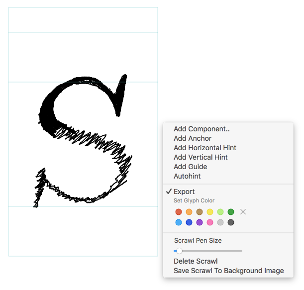

# Scrawl-Glyphs

TypeCooker™-style drawing for Glyphs.app

## Features

* No undo. Just Tipp-Ex®
* No outline tracing. Learn to draw with Béziers yourself, you lazy dog!

## Tips

* Best used with a pen tablet.
* Press C to activate Scrawl Tool
* Press E to switch between Draw and Erase modes
* Press 1–9 to quickly adjust the drawing tool size (check context menu for wider size range)
* You can view the scrawl in other tools by activating the Scrawl Reporter via menu _View > Show Scrawl_

## Bugs

* Image size and position are fixed, e.g. when you change the sidebearings, the image will stay at its initial position.
* Use a recent Glyphs version. Older versions had a bug when saving more than 64 kB in the user data lib. Complex drawings may reach that limit.
